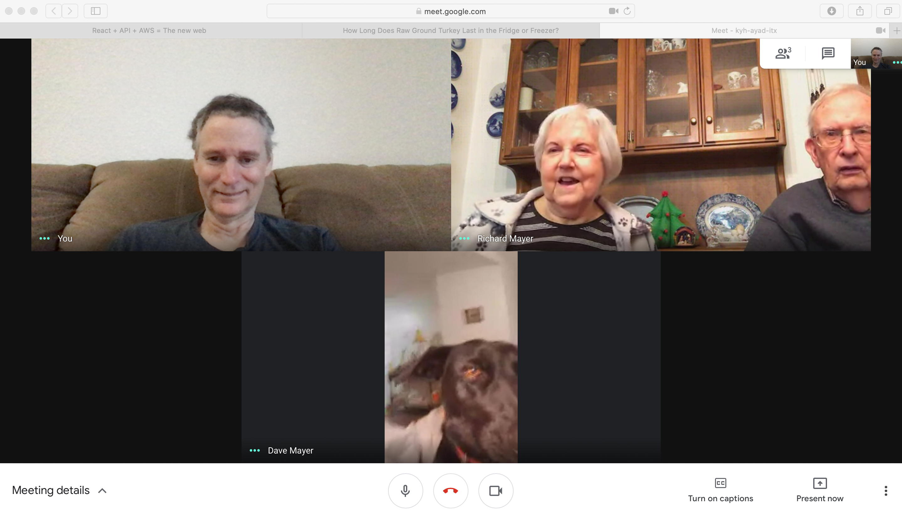

# Heading1

## Heading2

- [point 1](#point-1)
- [point 2](#point-2)
  - [point 2.1](#point-2.1)
  - point 2.2
    - point 2.2.1
- [Howdy & Hello](#howdy--hello) 

howdy

## Point 1
- hello

## Point 2

### Point 2.1
point 2.1
Is this okay?

### Point 2.2
point 2.2

### Point 2.2.1
howdy

## Howdy & Hello
